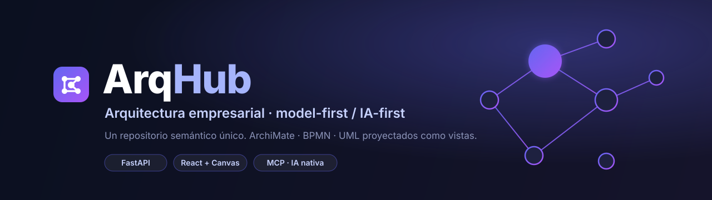
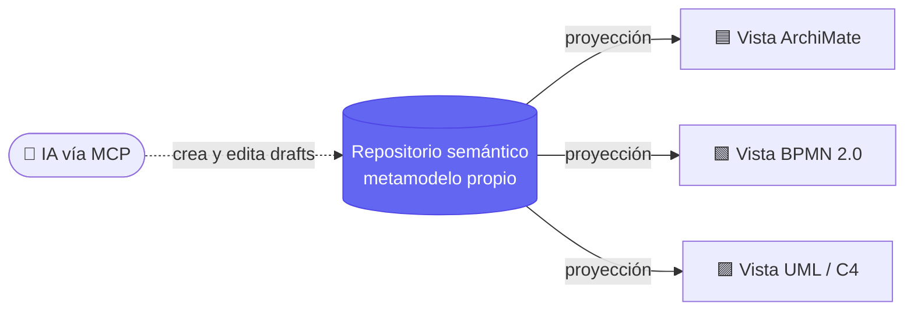
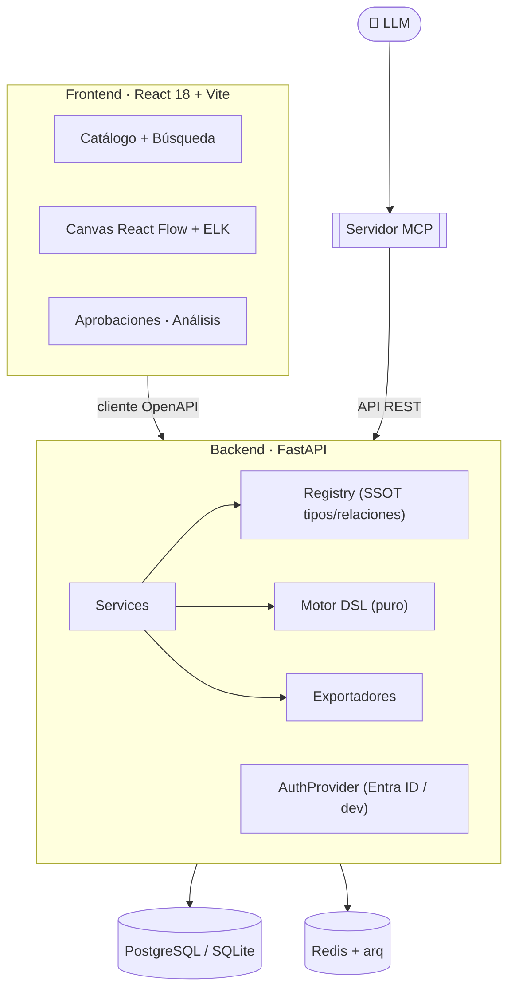

<p align="center">
  
</p>

<p align="center">
  <b>Plataforma de Arquitectura Empresarial <code>model-first</code> / <code>IA-first</code>.</b><br>
  Un <b>repositorio semántico único</b> del que se proyectan vistas <b>ArchiMate</b>, <b>BPMN</b> y <b>UML</b>.<br>
  La IA es un usuario de primera clase, vía <b>MCP</b>.
</p>

<p align="center">
  
  
  
  
  
  
  
  
</p>

---

## ✨ La idea en una frase

> El corazón no son los diagramas: es el **catálogo semántico**.
> Un elemento (ej. *"API de Pagos"*) se define **una sola vez** y se **proyecta** a cada lenguaje.
> Los diagramas son **vistas** del modelo, no el modelo.



Cambiás el elemento en el catálogo y **todas** las vistas donde aparece quedan consistentes.
Nunca hay dos verdades.

---

## 🚀 Qué hace

| | Módulo | Descripción |
|---|---|---|
| 🗂️ | **Catálogo semántico** | SSOT de elementos y relaciones. Búsqueda unificada con mini-lenguaje (`campo:valor`, rangos `..`) + búsqueda avanzada. Carpetas jerárquicas, permisos por grupo, campos personalizados por tipo. |
| 🎨 | **Canvas multi-lenguaje** | Editor React Flow con auto-layout ELK. Nodos y conectores conscientes del lenguaje (ArchiMate / BPMN / UML / C4). Nesting, snap-to-grid, undo/redo, drag & drop desde la paleta. |
| 🧬 | **DSL IA-first** | Formato textual puro y sin DB. Import (`model` / `patch` / `replace`), export con token canónico, **diff semántico** y **roundtrip garantizado** (`load(export(g)) == g`). |
| 🔄 | **Exportadores estándar** | ArchiMate Open Exchange XML · **BPMN 2.0 con BPMNDI** (abre en Camunda) · XMI (UML) · SVG server-side. |
| ✅ | **Governance** | Flujo `draft → in_review → published → deprecated` con snapshots congelados, aprobaciones multi-persona y auditoría de cada mutación. |
| 🔍 | **Análisis** | Duplicados, huérfanos, ciclo de vida, acoplamiento (p90) y violaciones de la matriz de tipos. |
| 🤖 | **Servidor MCP** | 15 tools que permiten a un LLM crear/editar componentes, vistas y carpetas — **sin** poder aprobar, publicar ni borrar (seguridad por diseño). |

---

## 🏗️ Arquitectura



**Principios de diseño**

- **Sin coordenadas en el modelo.** El layout es presentación (`view_layouts`), nunca semántica.
- **La matriz de tipos/relaciones es fuente única de verdad** (`registry.py`); el front la consume por API.
- **La capa DSL es pura y sin DB** → se testea sobre un grafo en memoria, sin Postgres.
- **La IA no aprueba, publica ni borra en cascada.** Solo crea/edita drafts y solicita aprobación.

---

## 🧰 Stack

| Capa | Tecnología |
|---|---|
| **Backend** | Python 3.12 · FastAPI · SQLAlchemy 2 · Alembic · Pydantic v2 |
| **Persistencia** | PostgreSQL 16 (dev: SQLite, sin infra) · Redis + arq (jobs, con fallback inline) |
| **Frontend** | React 18 · TypeScript · Vite · React Flow · ELK.js · Tailwind · TanStack Query |
| **Auth** | Entra ID (Azure AD) OIDC detrás de una interfaz `AuthProvider` · tokens personales para MCP |
| **Interop** | DSL YAML IA-first · exportadores ArchiMate/BPMN/XMI · servidor MCP (stdio + HTTP) |

---

## ⚡ Quickstart

Requisitos: **Python 3.12+**, **Node 20+**. Postgres/Redis son opcionales — en dev corre sobre SQLite y jobs inline.

```bash
# 1) Backend  →  API en :8000, docs OpenAPI en /docs
cd backend
python -m venv .venv
./.venv/Scripts/python -m pip install -e ".[dev]"     # Linux/mac: .venv/bin/python
# Secure by default (exige Entra ID). Para dev local sobre SQLite, habilitá el stub
# de auth (autentica como admin semilla; permitido sólo en SQLite):
ARQHUB_DEV_AUTH=true ./.venv/Scripts/python -m uvicorn app.main:app --reload
```

```bash
# 2) Frontend  →  UI en :5173 (proxy /api -> :8000)
cd frontend
npm install
npm run dev
```

```bash
# 3) (Opcional) Todo el stack con Postgres + Redis
cp .env.example .env      # poné POSTGRES_PASSWORD / REDIS_PASSWORD reales
docker compose up
```

> Defaults endurecidos: db/redis no publican puertos al host, Redis pide password y
> `dev_auth` está **apagado**. Para el demo abierto (todo request = admin, sin login),
> seteá en `.env`: `ARQHUB_DEV_AUTH=true` **y** `ARQHUB_ALLOW_INSECURE_DEV_AUTH=true`.
> Nunca en una red accesible por terceros.

> En Windows, `./dev.ps1` levanta backend + frontend y abre el navegador.

### Tests

```bash
cd backend && ./.venv/Scripts/python -m pytest -q      # 116 tests · gate de cobertura 85% (actual 91%)
cd frontend && npm test                                # Vitest — lógica pura (motor de búsqueda)
```

---

## 🤖 IA vía MCP

ArqHub expone un servidor **MCP** para que un asistente (Claude, u otro) opere el modelo como un usuario más:
crear elementos y relaciones, generar y poblar vistas, crear carpetas y ubicarlas, exportar.

```bash
cd mcp-server
# Autenticación: token personal generado desde el perfil del usuario (Perfil → Tokens)
ARQHUB_PAT=arqhub_xxx python -m arqhub_mcp.server
```

Las operaciones sensibles (aprobar, publicar, borrar) **no** están expuestas: la IA propone, las personas deciden.

---

## 🗺️ Roadmap

- [x] **Fase 1 — Núcleo del repositorio + DSL** · registry SSOT, motor DSL, API REST, migraciones, Entra ID OIDC, jobs arq, RLS Postgres.
- [x] **Fase 2 — Canvas ArchiMate + catálogo** · app shell, fichas navegables, explorador de vistas, editor React Flow.
- [x] **Fase 3 — BPMN/UML + exportadores** · exportadores estándar, canvas consciente del lenguaje, C4.
- [x] **Fase 4 — Governance + notificaciones** · workflow de aprobaciones, notificaciones (incl. Teams).
- [x] **Fase 5 — MCP + análisis** · motor de análisis, servidor MCP (15 tools).
- [ ] **Fase 6 — Hardening** · RLS FORCE + rol dedicado, performance del canvas >200 nodos, backup/restore.

---

## 📚 Documentación

- [`defs/SPEC-plataforma-diagramas.md`](defs/SPEC-plataforma-diagramas.md) — especificación completa.
- [`docs/archimate-notation.md`](docs/archimate-notation.md) — referencia de notación ArchiMate para el canvas.
- [`CLAUDE.md`](CLAUDE.md) — convenciones de desarrollo.

## 📄 Licencia

Sin licencia definida aún (todos los derechos reservados por defecto). El material de referencia de
terceros con copyright **no** se incluye en el repositorio.

<p align="center"><sub>Hecho con foco en el modelo. Los diagramas son solo una vista. 🧠</sub></p>
